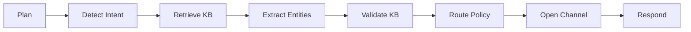

# System Architecture

## High-Level Overview

```
┌─────────────────────────────────────────────────────────────────┐
│                        Client Applications                       │
│         (Web, WhatsApp, Telegram, Email, Voice/IVR)            │
└─────────────────────┬───────────────────────────────────────────┘
                      │
                      ▼
┌─────────────────────────────────────────────────────────────────┐
│                      FastAPI Gateway                             │
│  ┌──────────────┬──────────────┬──────────────┬──────────────┐ │
│  │ Intent API   │ Channel API  │ Ingest API   │ Health API   │ │
│  └──────────────┴──────────────┴──────────────┴──────────────┘ │
└─────────────────────┬───────────────────────────────────────────┘
                      │
                      ▼
┌─────────────────────────────────────────────────────────────────┐
│                    LangGraph Agent Layer                         │
│  ┌──────────┐  ┌──────────┐  ┌──────────┐  ┌──────────┐       │
│  │ Planner  │→ │ Detector │→ │Retriever │→ │Extractor │       │
│  └──────────┘  └──────────┘  └──────────┘  └──────────┘       │
│       │              │              │              │             │
│       ▼              ▼              ▼              ▼             │
│  ┌──────────┐  ┌──────────┐  ┌──────────┐  ┌──────────┐       │
│  │Validator │→ │  Router  │→ │ Writer   │→ │Responder │       │
│  └──────────┘  └──────────┘  └──────────┘  └──────────┘       │
└─────────────────────┬───────────────────────────────────────────┘
                      │
        ┌─────────────┼─────────────┬─────────────┐
        ▼             ▼             ▼             ▼
┌──────────────┐ ┌──────────┐ ┌──────────┐ ┌──────────┐
│ Google Gemini│ │  FAISS   │ │PostgreSQL│ │  Redis   │
│   (LLM +     │ │ Vector   │ │   (or    │ │ (Cache)  │
│  Embeddings) │ │  Store   │ │ SQLite)  │ │          │
└──────────────┘ └──────────┘ └──────────┘ └──────────┘
```

## Component Details

### 1. API Gateway (FastAPI)

**Location**: `app/api/`

**Responsibilities**:
- HTTP request handling
- Request validation (Pydantic)
- Response serialization
- Error handling
- Tracing (X-Trace-Id)
- CORS handling

**Routers**:
- **Intent Router** (`intent.py`): Intent detection endpoints
- **Channel Router** (`channels.py`): Channel CRUD operations
- **Ingest Router** (`ingest.py`): Document ingestion

### 2. LangGraph Agent Layer

**Location**: `app/agents/`

**Agent Workflow**:



**Nodes**:
1. **Plan**: Entry point, initializes state
2. **Detect Intent**: LLM-based classification (Gemini)
3. **Retrieve KB**: FAISS similarity search
4. **Extract Entities**: Slot filling with KB context
5. **Validate KB**: Cross-reference entities with KB
6. **Route Policy**: YAML-based routing rules
7. **Open Channel**: Create/update channel records
8. **Respond**: Format final response

**State Management**:
```python
AgentState {
  utterance: str
  tenant: str
  intent: str
  entities: dict
  kb_results: list
  citations: list
  validated: bool
  channel_created: dict
  error: str
}
```

### 3. Services Layer

**Location**: `app/services/`

#### Intent Detection Service
- LLM-based intent classification
- Few-shot prompting
- Confidence scoring
- OOD detection

#### LLM Service
- Gemini API integration
- JSON response parsing
- Error handling
- Rate limiting (future)

#### Retrieval Service
- FAISS search
- Citation generation
- KB-based Q&A
- Entity validation

#### Ingestion Service
- Document parsing (.pdf/.docx)
- Text chunking
- Embedding generation
- FAISS indexing

#### Policy Service
- YAML policy loading
- Intent routing
- Validation rules
- Fallback handling

#### Prompt Service
- Template management
- Few-shot examples
- Prompt formatting

### 4. RAG Pipeline

**Location**: `app/rag/`

#### Chunking
```python
RecursiveCharacterTextSplitter(
  chunk_size=800,
  chunk_overlap=120,
  separators=["\n\n", "\n", ". ", " "]
)
```

#### Embeddings
- Model: `models/embedding-001` (Gemini)
- Dimension: 768
- Batch processing supported

#### Vector Store (FAISS)
```python
IndexFlatL2(dimension=768)
- Per-tenant indexes
- Metadata filtering
- Persistence to disk
```

#### Retrieval
```python
search(query, k=6, filters={tenant, doc_type, department})
→ [{content, metadata, score}]
```

### 5. Data Layer

**Location**: `app/models/`, `app/db/`

#### Database Models (SQLAlchemy)
- **Channel**: Channel records
- **ChannelDetail**: Key-value details
- **Event**: Audit logs
- **KbDoc**: Document metadata
- **KbChunk**: Text chunks

#### Pydantic Schemas
- **IntentRequest/Result**: Intent API contracts
- **EntitySchema**: Extracted entities
- **Citation**: KB references
- **UnderstandAndOpenRequest/Response**: Workflow contracts

#### Database
- **Development**: SQLite
- **Production**: PostgreSQL (recommended)
- **Migrations**: Alembic (future)

### 6. External Dependencies

#### Google Gemini
- **Model**: `gemini-1.5-flash`
- **Temperature**: 0.0 (deterministic)
- **Use Cases**:
  - Intent classification
  - Entity extraction
  - KB validation
  - Q&A generation
  - Embeddings

#### FAISS
- **Type**: Flat L2 index
- **Storage**: Per-tenant directories
- **Persistence**: Pickle metadata + FAISS binary

#### Redis (Optional)
- Embedding cache
- Session storage
- Rate limiting

## Data Flow

### Ingestion Flow

```
Upload .pdf/.docx
    ↓
Extract Text (pypdf/docx2txt)
    ↓
Chunk (800 chars, 120 overlap)
    ↓
Embed (Gemini Embeddings)
    ↓
Index (FAISS + DB)
    ↓
Save to Disk
```

### Intent Detection Flow

```
User Utterance
    ↓
Load Router Prompt + Few-shot Examples
    ↓
Call Gemini LLM
    ↓
Parse JSON Response
    ↓
Extract {intent, confidence, entities}
    ↓
Check OOD (confidence < threshold)
    ↓
Return IntentResult
```

### Open Channel Flow

```
Utterance → LangGraph Agent
    ↓
Detect Intent (open_channel)
    ↓
Retrieve KB (channel availability)
    ↓
Extract Entities (channel, dept, ops)
    ↓
Validate with KB (cross-reference)
    ↓
Check Policy (requires_kb_validation=true)
    ↓
Create Channel Record
    ↓
Add Channel Details (key-value)
    ↓
Generate Citations
    ↓
Return Response with Channel ID
```

## Security Considerations

1. **PII Protection**: Utterances redacted in logs
2. **API Keys**: Environment variables only
3. **Input Validation**: Pydantic models
4. **SQL Injection**: SQLAlchemy ORM
5. **CORS**: Configurable origins
6. **Rate Limiting**: (Future) Redis-based
7. **HTTPS**: Production requirement

## Performance Optimizations

1. **Embedding Cache**: Redis for frequently queried texts
2. **Connection Pooling**: Database connections
3. **Batch Processing**: Embeddings generation
4. **Index Loading**: Keep FAISS in memory
5. **Async Operations**: FastAPI async routes
6. **Worker Processes**: Multiple Uvicorn workers

## Scaling Strategy

### Horizontal Scaling
- Stateless API servers
- Load balancer (nginx/HAProxy)
- Shared PostgreSQL + Redis
- Shared FAISS indexes (network mount or S3)

### Vertical Scaling
- Increase workers per instance
- GPU for embeddings
- Larger FAISS indexes in memory

### Caching Layers
- L1: In-memory (per-worker)
- L2: Redis (shared)
- L3: CDN (static assets)

## Monitoring & Observability

1. **Trace IDs**: Every request gets unique ID
2. **Structured Logging**: JSON logs for aggregation
3. **Event Logs**: Database audit trail
4. **Health Checks**: `/health` endpoint
5. **Metrics**: (Future) Prometheus exporter
6. **Alerts**: (Future) Error rate, latency thresholds

## Extension Points

1. **New Intents**: Add to `prompts/router.yaml`
2. **New Entities**: Extend `EntitySchema`
3. **New Tools**: Add to `app/agents/tools.py`
4. **New Nodes**: Extend LangGraph workflow
5. **Custom Policies**: Edit `policies/router.yaml`
6. **New Channels**: Update database schema
