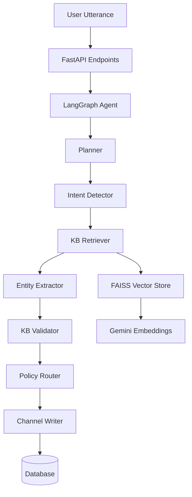

# GenAI Intent Understanding System for Digital Channels

A production-ready **multi-channel intent understanding service** for banking (extensible to other domains) built with **Python**, **Google Gemini**, **LangChain**, **FAISS**, and **LangGraph**.

## Features

- **Multi-channel support**: Web chat, WhatsApp, Telegram, Email, Voice/IVR
- **Intent detection** with confidence scoring and OOD detection
- **Entity extraction** with structured slot filling
- **RAG-powered validation** using FAISS vector store
- **LangGraph agent orchestration** for complex workflows
- **Document ingestion** from Word/PDF files
- **Policy-based routing** with YAML configuration
- **Channel management** with full CRUD operations
- **Comprehensive observability** with tracing and logging

## Architecture



### Components

1. **Ingestion Service**: Extracts text from .docx/.pdf, chunks, embeds, and indexes in FAISS
2. **RAG Service**: Hybrid retrieval with dense search and reranking
3. **Intent Pipeline**: LLM-based classification with OOD detection
4. **LangGraph Agents**: Orchestrates multi-step workflows
5. **Policy Router**: YAML-based routing rules
6. **Channel Manager**: Persists channel configurations

## Quick Start

### Prerequisites

- Python 3.11+
- Google Gemini API key

### Installation

1. Clone the repository:
```bash
git clone <repo-url>
cd intentdectionsystem
```

2. Create virtual environment:
```bash
python -m venv venv
source venv/bin/activate  # On Windows: venv\Scripts\activate
```

3. Install dependencies:
```bash
make install
# or
pip install -r requirements.txt
```

4. Configure environment:
```bash
cp .env.example .env
# Edit .env and add your GOOGLE_API_KEY
```

5. Initialize database:
```bash
make db-init
# or
python scripts/init_db.py
```

### Running the Application

#### Development Mode
```bash
make run
# or
python -m uvicorn app.main:app --reload
```

#### Production Mode
```bash
make run-prod
# or
python -m uvicorn app.main:app --host 0.0.0.0 --port 8000 --workers 4
```

#### Docker
```bash
make docker-build
make docker-run
# or
docker-compose up -d
```

Access the API at: http://localhost:8000

Interactive docs: http://localhost:8000/docs

## Usage

### 1. Ingest Knowledge Base Documents

```bash
# Ingest PDF/DOCX files
make ingest DOCS="./kb/*.pdf" TENANT=bank-asia

# Or use the script directly
python scripts/ingest_cli.py --tenant bank-asia --doc-type channels ./kb/Digital_Channels_2025.pdf
```

**Via API:**
```bash
curl -X POST http://localhost:8000/ingest \
  -F "files=@./kb/Digital_Channels_2025.pdf" \
  -F "tenant=bank-asia" \
  -F "doc_type=channels" \
  -F "department=retail_banking"
```

### 2. Detect Intent

```bash
curl -X POST http://localhost:8000/intent/v1/detect \
  -H "Content-Type: application/json" \
  -d '{
    "utterance": "What are NEFT transfer charges?",
    "channel": "web",
    "locale": "en-IN",
    "tenant": "bank-asia"
  }'
```

**Response:**
```json
{
  "intent": "faq_policy",
  "confidence": 0.88,
  "entities": {
    "operation": "fund_transfer"
  },
  "ood": false,
  "traceId": "abc123"
}
```

### 3. Understand and Open Channel (End-to-End)

```bash
curl -X POST http://localhost:8000/intent/v1/understand-and-open \
  -H "Content-Type: application/json" \
  -d '{
    "utterance": "Open WhatsApp channel for Retail Banking and enable card block",
    "tenant": "bank-asia",
    "defaults": {
      "status": "active"
    }
  }'
```

**Response:**
```json
{
  "intent": "open_channel",
  "confidence": 0.87,
  "entities": {
    "channel": "whatsapp",
    "department": "retail_banking",
    "operations": ["card_block"]
  },
  "validated_from_kb": true,
  "citations": [
    {
      "doc": "Digital_Channels_2025_v3.pdf",
      "page": 7,
      "snippet": "WhatsApp—supported ops: balance, card block, dispute",
      "score": 0.92
    }
  ],
  "channel_record": {
    "id": "CH-20251024-0001",
    "name": "whatsapp-retail_banking",
    "status": "active"
  },
  "traceId": "t-abc123"
}
```

### 4. Get Channel Details

```bash
curl http://localhost:8000/channels/CH-20251024-0001
```

### 5. Simulate Multiple Utterances

```bash
curl -X POST http://localhost:8000/intent/v1/simulate \
  -H "Content-Type: application/json" \
  -d '{
    "utterances": [
      "Open WhatsApp channel for retail",
      "What are NEFT charges?",
      "Block my credit card"
    ],
    "tenant": "bank-asia"
  }'
```

## Configuration

### Environment Variables

| Variable | Description | Default |
|----------|-------------|---------|
| `GOOGLE_API_KEY` | Google Gemini API key | Required |
| `DB_URL` | Database connection URL | `sqlite:///./data/app.db` |
| `VECTOR_DIR` | FAISS indexes directory | `./data/indexes` |
| `TENANT` | Default tenant | `bank-asia` |
| `LANGUAGE` | Default language | `en-IN` |
| `MIN_CONFIDENCE` | Minimum confidence threshold | `0.7` |
| `CHUNK_SIZE` | Text chunk size | `800` |
| `RETRIEVAL_TOP_K` | Top K retrievals | `6` |
| `LOG_LEVEL` | Logging level | `INFO` |
| `ENV` | Environment | `development` |

### Policy Configuration

Edit [policies/router.yaml](policies/router.yaml) to configure:
- Intent routes
- Tool mappings
- KB validation requirements
- Confidence thresholds

### Prompt Templates

Customize prompts in [prompts/](prompts/) directory:
- `router.yaml` - Intent classification
- `entities.yaml` - Entity extraction
- `rag_answer.yaml` - RAG responses
- `validate_kb.yaml` - KB validation

## Testing

### Run All Tests
```bash
make test
# or
pytest tests/ -v --cov=app
```

### Run Offline Evaluation
```bash
make eval
# or
python eval/evaluate.py
```

Evaluation metrics:
- Overall accuracy
- Per-intent F1 scores
- OOD detection rate

## API Endpoints

### Intent Detection
- `POST /intent/v1/detect` - Detect intent from utterance
- `POST /intent/v1/understand-and-open` - Full workflow with channel creation
- `POST /intent/v1/simulate` - Test multiple utterances

### Channel Management
- `GET /channels/{id}` - Get channel details
- `GET /channels/` - List channels (with filters)

### Knowledge Base
- `POST /ingest` - Ingest documents

### System
- `GET /health` - Health check
- `GET /` - API info

Full API documentation: http://localhost:8000/docs

## Data Models

### IntentResult
```python
{
  "intent": str,
  "confidence": float,
  "entities": EntitySchema,
  "ood": bool,
  "traceId": str
}
```

### EntitySchema
```python
{
  "channel": str | None,
  "application": str | None,
  "department": str | None,
  "operation": str | None,
  "operations": list[str] | None,
  "amount": float | None,
  "account_type": str | None
}
```

### Available Intents
- `open_channel` - Register/open new channel
- `close_channel` - Close/deactivate channel
- `modify_channel` - Modify channel settings
- `faq_policy` - General questions
- `account_inquiry` - Account queries
- `transaction` - Payments/transfers
- `complaint` - Complaints
- `card_services` - Card operations
- `ood` - Out-of-domain

## Database Schema

### Tables
- `channels` - Channel records
- `channel_details` - Channel key-value details
- `events` - Event logs
- `kb_docs` - Knowledge base documents
- `kb_chunks` - Document chunks

See [app/models/database.py](app/models/database.py) for full schema.

## Development

### Code Quality
```bash
# Format code
make format

# Run linters
make lint

# Type checking
mypy app/ --ignore-missing-imports
```

### Project Structure
```
.
├── app/
│   ├── agents/          # LangGraph agents
│   ├── api/             # FastAPI routers
│   ├── config/          # Configuration
│   ├── db/              # Database utilities
│   ├── models/          # Data models
│   ├── rag/             # RAG components
│   ├── services/        # Business logic
│   └── utils/           # Utilities
├── prompts/             # Prompt templates
├── policies/            # Policy configurations
├── tests/               # Unit tests
├── eval/                # Evaluation scripts
├── scripts/             # CLI scripts
├── kb/                  # Knowledge base files (not in git)
└── data/                # Runtime data (not in git)
```

## Scaling & Production

### Performance Optimization
1. **Autoscaling**: Use Kubernetes HPA based on CPU/memory
2. **Caching**: Enable Redis for embedding cache
3. **Database**: Switch to PostgreSQL for production
4. **Workers**: Run multiple Uvicorn workers
5. **GPU**: Use GPU-enabled embeddings for better performance

### Cold Start Mitigation
- Pre-load models at startup
- Keep FAISS indexes in memory
- Use connection pooling

### Cost Optimization
- Batch embeddings generation
- Cache frequent queries
- Use Gemini Flash for lower latency
- Monitor API usage

### Security
- Never log PII (utterances are redacted in logs)
- Use API keys for authentication
- Enable HTTPS in production
- Implement rate limiting
- Validate all inputs

### Monitoring
- Health check endpoint: `/health`
- Trace IDs in all responses
- Structured logging
- Event logs in database

## Troubleshooting

### Common Issues

**Issue**: Import errors when running
```bash
export PYTHONPATH="${PYTHONPATH}:$(pwd)"
```

**Issue**: FAISS index not found
```bash
# Ensure documents are ingested first
make ingest DOCS="./kb/*.pdf"
```

**Issue**: Low confidence scores
- Check prompt templates in `prompts/`
- Ensure KB has relevant content
- Adjust `MIN_CONFIDENCE` in `.env`

**Issue**: Gemini API errors
- Verify `GOOGLE_API_KEY` is set
- Check API quotas
- Ensure internet connectivity

## License

[Your License]

## Contributing

1. Fork the repository
2. Create feature branch (`git checkout -b feature/amazing-feature`)
3. Commit changes (`git commit -m 'Add amazing feature'`)
4. Push to branch (`git push origin feature/amazing-feature`)
5. Open Pull Request

## Support

For issues and questions:
- GitHub Issues: [link]
- Documentation: http://localhost:8000/docs
- Email: [support email]

---

**Built with**:
- [FastAPI](https://fastapi.tiangolo.com/)
- [LangChain](https://python.langchain.com/)
- [Google Gemini](https://ai.google.dev/)
- [FAISS](https://github.com/facebookresearch/faiss)
- [LangGraph](https://github.com/langchain-ai/langgraph)
