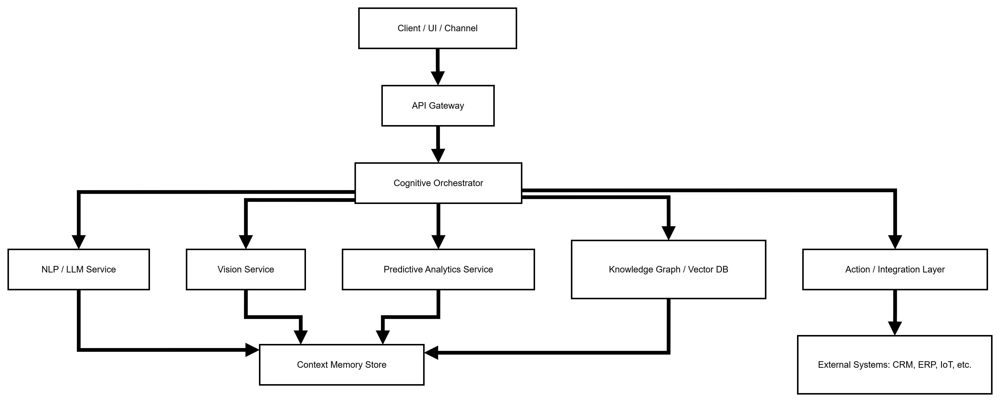
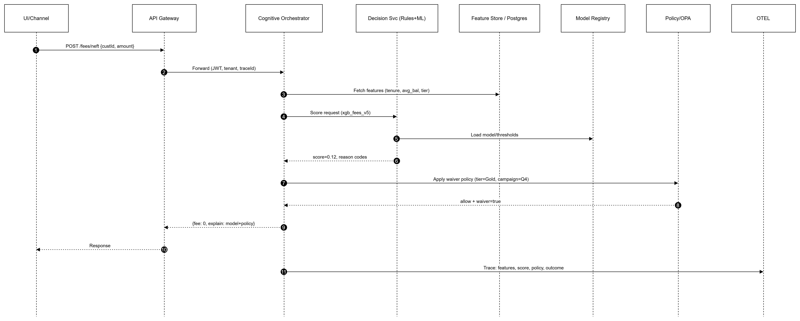

# GenAI Intent Understanding System for Digital Channels

A production-ready **multi-channel intent understanding service** for banking (extensible to other domains) built with **Python**, **Google Gemini**, **LangChain**, **FAISS**, and **LangGraph**.

## Features

- **Multi-channel support**: Web chat, WhatsApp, Telegram, Email, Voice/IVR
- **Intent detection** with confidence scoring and OOD detection
- **Entity extraction** with structured slot filling
- **RAG-powered validation** using FAISS vector store
- **LangGraph agent orchestration** for complex workflows
- **Document ingestion** from Word/PDF files
- **Policy-based routing** with YAML configuration
- **Channel management** with full CRUD operations
- **Comprehensive observability** with tracing and logging

## Architecture


### Components

1. **Ingestion Service**: Extracts text from .docx/.pdf, chunks, embeds, and indexes in FAISS
2. **RAG Service**: Hybrid retrieval with dense search and reranking
3. **Intent Pipeline**: LLM-based classification with OOD detection
4. **LangGraph Agents**: Orchestrates multi-step workflows
5. **Policy Router**: YAML-based routing rules
6. **Channel Manager**: Persists channel configurations

## Quick Start

### Prerequisites

- Python 3.11+
- Google Gemini API key

### Installation

1. Clone the repository:
```bash
git clone <repo-url>
cd intentdectionsystem
```

2. Create virtual environment:
```bash
python -m venv venv
source venv/bin/activate  # On Windows: venv\Scripts\activate
```

3. Install dependencies:
```bash
make install
# or
pip install -r requirements.txt
```

4. Configure environment:
```bash
cp .env.example .env
# Edit .env and add your GOOGLE_API_KEY
```

5. Initialize database:
```bash
make db-init
# or
python scripts/init_db.py
```

### Running the Application

#### Development Mode
```bash
make run
# or
python -m uvicorn app.main:app --reload
```

#### Production Mode
```bash
make run-prod
# or
python -m uvicorn app.main:app --host 0.0.0.0 --port 8000 --workers 4
```

#### Docker
```bash
make docker-build
make docker-run
# or
docker-compose up -d
```

Access the API at: http://localhost:8000

Interactive docs: http://localhost:8000/docs

## Usage

### 1. Ingest Knowledge Base Documents

```bash
# Ingest PDF/DOCX files
make ingest DOCS="./kb/*.pdf" TENANT=bank-asia

# Or use the script directly
python scripts/ingest_cli.py --tenant bank-asia --doc-type channels ./kb/Digital_Channels_2025.pdf
```

**Via API:**
```bash
curl -X POST http://localhost:8000/ingest \
  -F "files=@./kb/Digital_Channels_2025.pdf" \
  -F "tenant=bank-asia" \
  -F "doc_type=channels" \
  -F "department=retail_banking"
```

### 2. Detect Intent

```bash
curl -X POST http://localhost:8000/intent/v1/detect \
  -H "Content-Type: application/json" \
  -d '{
    "utterance": "What are NEFT transfer charges?",
    "channel": "web",
    "locale": "en-IN",
    "tenant": "bank-asia"
  }'
```

**Response:**
```json
{
  "intent": "faq_policy",
  "confidence": 0.88,
  "entities": {
    "operation": "fund_transfer"
  },
  "ood": false,
  "traceId": "abc123"
}
```

### 3. Understand and Open Channel (End-to-End)

```bash
curl -X POST http://localhost:8000/intent/v1/understand-and-open \
  -H "Content-Type: application/json" \
  -d '{
    "utterance": "Open WhatsApp channel for Retail Banking and enable card block",
    "tenant": "bank-asia",
    "defaults": {
      "status": "active"
    }
  }'
```

**Response:**
```json
{
  "intent": "open_channel",
  "confidence": 0.87,
  "entities": {
    "channel": "whatsapp",
    "department": "retail_banking",
    "operations": ["card_block"]
  },
  "validated_from_kb": true,
  "citations": [
    {
      "doc": "Digital_Channels_2025_v3.pdf",
      "page": 7,
      "snippet": "WhatsApp—supported ops: balance, card block, dispute",
      "score": 0.92
    }
  ],
  "channel_record": {
    "id": "CH-20251024-0001",
    "name": "whatsapp-retail_banking",
    "status": "active"
  },
  "traceId": "t-abc123"
}
```

### 4. Get Channel Details

```bash
curl http://localhost:8000/channels/CH-20251024-0001
```

### 5. Simulate Multiple Utterances

```bash
curl -X POST http://localhost:8000/intent/v1/simulate \
  -H "Content-Type: application/json" \
  -d '{
    "utterances": [
      "Open WhatsApp channel for retail",
      "What are NEFT charges?",
      "Block my credit card"
    ],
    "tenant": "bank-asia"
  }'
```

## Configuration

### Environment Variables

| Variable | Description | Default |
|----------|-------------|---------|
| `GOOGLE_API_KEY` | Google Gemini API key | Required |
| `DB_URL` | Database connection URL | `sqlite:///./data/app.db` |
| `VECTOR_DIR` | FAISS indexes directory | `./data/indexes` |
| `TENANT` | Default tenant | `bank-asia` |
| `LANGUAGE` | Default language | `en-IN` |
| `MIN_CONFIDENCE` | Minimum confidence threshold | `0.7` |
| `CHUNK_SIZE` | Text chunk size | `800` |
| `RETRIEVAL_TOP_K` | Top K retrievals | `6` |
| `LOG_LEVEL` | Logging level | `INFO` |
| `ENV` | Environment | `development` |

### Policy Configuration

Edit [policies/router.yaml](policies/router.yaml) to configure:
- Intent routes
- Tool mappings
- KB validation requirements
- Confidence thresholds

### Prompt Templates

Customize prompts in [prompts/](prompts/) directory:
- `router.yaml` - Intent classification
- `entities.yaml` - Entity extraction
- `rag_answer.yaml` - RAG responses
- `validate_kb.yaml` - KB validation

## Testing

### Run All Tests
```bash
make test
# or
pytest tests/ -v --cov=app
```

### Run Offline Evaluation
```bash
make eval
# or
python eval/evaluate.py
```

Evaluation metrics:
- Overall accuracy
- Per-intent F1 scores
- OOD detection rate

## API Endpoints

### Intent Detection
- `POST /intent/v1/detect` - Detect intent from utterance
- `POST /intent/v1/understand-and-open` - Full workflow with channel creation
- `POST /intent/v1/simulate` - Test multiple utterances

### Channel Management
- `GET /channels/{id}` - Get channel details
- `GET /channels/` - List channels (with filters)

### Knowledge Base
- `POST /ingest` - Ingest documents

### System
- `GET /health` - Health check
- `GET /` - API info

Full API documentation: http://localhost:8000/docs

## Data Models

### IntentResult
```python
{
  "intent": str,
  "confidence": float,
  "entities": EntitySchema,
  "ood": bool,
  "traceId": str
}
```

### EntitySchema
```python
{
  "channel": str | None,
  "application": str | None,
  "department": str | None,
  "operation": str | None,
  "operations": list[str] | None,
  "amount": float | None,
  "account_type": str | None
}
```

### Available Intents
- `open_channel` - Register/open new channel
- `close_channel` - Close/deactivate channel
- `modify_channel` - Modify channel settings
- `faq_policy` - General questions
- `account_inquiry` - Account queries
- `transaction` - Payments/transfers
- `complaint` - Complaints
- `card_services` - Card operations
- `ood` - Out-of-domain

## Database Schema

### Tables
- `channels` - Channel records
- `channel_details` - Channel key-value details
- `events` - Event logs
- `kb_docs` - Knowledge base documents
- `kb_chunks` - Document chunks

See [app/models/database.py](app/models/database.py) for full schema.

## Development

### Code Quality
```bash
# Format code
make format

# Run linters
make lint

# Type checking
mypy app/ --ignore-missing-imports
```

### Project Structure
```
.
├── app/
│   ├── agents/          # LangGraph agents
│   ├── api/             # FastAPI routers
│   ├── config/          # Configuration
│   ├── db/              # Database utilities
│   ├── models/          # Data models
│   ├── rag/             # RAG components
│   ├── services/        # Business logic
│   └── utils/           # Utilities
├── prompts/             # Prompt templates
├── policies/            # Policy configurations
├── tests/               # Unit tests
├── eval/                # Evaluation scripts
├── scripts/             # CLI scripts
├── kb/                  # Knowledge base files (not in git)
└── data/                # Runtime data (not in git)
```

## Scaling & Production

### Performance Optimization
1. **Autoscaling**: Use Kubernetes HPA based on CPU/memory
2. **Caching**: Enable Redis for embedding cache
3. **Database**: Switch to PostgreSQL for production
4. **Workers**: Run multiple Uvicorn workers
5. **GPU**: Use GPU-enabled embeddings for better performance

### Cold Start Mitigation
- Pre-load models at startup
- Keep FAISS indexes in memory
- Use connection pooling

### Cost Optimization
- Batch embeddings generation
- Cache frequent queries
- Use Gemini Flash for lower latency
- Monitor API usage

### Security
- Never log PII (utterances are redacted in logs)
- Use API keys for authentication
- Enable HTTPS in production
- Implement rate limiting
- Validate all inputs

### Monitoring
- Health check endpoint: `/health`
- Trace IDs in all responses
- Structured logging
- Event logs in database

## Troubleshooting

### Common Issues

**Issue**: Import errors when running
```bash
export PYTHONPATH="${PYTHONPATH}:$(pwd)"
```

**Issue**: FAISS index not found
```bash
# Ensure documents are ingested first
make ingest DOCS="./kb/*.pdf"
```

**Issue**: Low confidence scores
- Check prompt templates in `prompts/`
- Ensure KB has relevant content
- Adjust `MIN_CONFIDENCE` in `.env`

**Issue**: Gemini API errors
- Verify `GOOGLE_API_KEY` is set
- Check API quotas
- Ensure internet connectivity

## License

[Your License]

## Contributing

1. Fork the repository
2. Create feature branch (`git checkout -b feature/amazing-feature`)
3. Commit changes (`git commit -m 'Add amazing feature'`)
4. Push to branch (`git push origin feature/amazing-feature`)
5. Open Pull Request

## Support

For issues and questions:
- GitHub Issues: [link]
- Documentation: http://localhost:8000/docs
- Email: [support email]

---

**Built with**:
- [FastAPI](https://fastapi.tiangolo.com/)
- [LangChain](https://python.langchain.com/)
- [Google Gemini](https://ai.google.dev/)
- [FAISS](https://github.com/facebookresearch/faiss)
- [LangGraph](https://github.com/langchain-ai/langgraph)


                 ┌─────────────────────────────────────────┐
                 │             User Interfaces             │
                 │ ─────────────────────────────────────── │
                 │  💬 Chatbot   🌐 Web App   🎙️ Voice App │
                 └─────────────────────────────────────────┘
                                    │
                                    ▼
                        ┌────────────────────┐
                        │     API Gateway    │
                        │ (Auth, Routing, LB)│
                        └────────────────────┘
                                    │
                                    ▼
                     ┌──────────────────────────────────┐
                     │    Cognitive Microservices Layer  │
                     │──────────────────────────────────│
                     │                                  │
                     │  🗣️ Speech Recognition Service    │
                     │  💬 NLP / Intent Detection Service│
                     │  👁️ Vision / Image Analysis       │
                     │  🎯 Recommendation Engine          │
                     │  🧠 Decision / Reasoning Engine    │
                     │                                  │
                     └──────────────────────────────────┘
                                    │
                        ┌───────────┴───────────┐
                        │       Message Bus      │
                        │ (Kafka / RabbitMQ etc.)│
                        └───────────┬───────────┘
                                    │
                                    ▼
                 ┌─────────────────────────────────────────┐
                 │          Model Serving Layer             │
                 │ (TensorFlow Serving / TorchServe / MLflow)│
                 └─────────────────────────────────────────┘
                                    │
                                    ▼
                 ┌─────────────────────────────────────────┐
                 │          Data & Knowledge Layer          │
                 │  🗄️ Databases, Knowledge Graph, Cache     │
                 └─────────────────────────────────────────┘
                                    │
                                    ▼
                 ┌─────────────────────────────────────────┐
                 │      Monitoring & Management Layer       │
                 │ (Prometheus, Grafana, CI/CD, Logs, APM)  │
                 └─────────────────────────────────────────┘
🧩 How It Works

* Users interact through a chatbot, web app, or voice interface.
* Requests hit the API Gateway, which routes them securely.
* The Cognitive Microservices handle distinct intelligent tasks — each running in its own container.
* Services communicate via a Message Bus (asynchronous, event-driven).
* AI models are hosted in the Model Serving Layer for inference.
* Data and knowledge are stored in databases or knowledge graphs.
* Everything is observed and maintained through a Monitoring Layer.


Cognitive microservices are autonomous, self-contained services that incorporate cognitive intelligence — such as perception, learning, reasoning, and natural language understanding — to handle complex business functions.
They go beyond simple CRUD or data transformation logic, enabling systems to perceive context, infer meaning, and adapt dynamically.

⚙️ Core Characteristics
Traditional Microservice	  Cognitive Microservice Enhancement
1. Fixed rule-based logic	- Adaptive, learning-based behavior
2. Static data flow	- Context-aware, semantic reasoning
3. Stateless API calls	- Stateful knowledge and memory
4. Independent APIs	- Autonomous agents collaborating via AI
5. DevOps-driven	- MLOps + LLMOps + Observability



🚀 Key Enablers

* AI/ML frameworks – TensorFlow, PyTorch, Scikit-learn.
* LLM frameworks – LangChain, Semantic Kernel, Hugging Face, LangGraph.
* Data fabric – Vector DBs (FAISS, Chroma, Weaviate).
* Knowledge graph – Neo4j, RDF, or Ontology-driven reasoning.
* Event mesh – Kafka, NATS, MQTT for asynchronous cognitive event flow.
* Containerization and orchestration – Docker + Kubernetes + MLOps pipelines.

Overview

The Cognitive Microservices Architecture represents the evolution of traditional microservice ecosystems into intelligent, self-learning, and adaptive service networks. Each service not only performs domain-specific operations but also perceives, reasons, learns, and acts autonomously — mimicking human cognitive processes.

This architecture serves as the backbone of the Cognitive Enterprise Fabric (CEF) — enabling seamless orchestration between AI agents, data intelligence, and enterprise applications across domains like banking, manufacturing, education, and healthcare.

🧩 Core Principles

**Autonomous Intelligence** – Each microservice embeds AI/ML models for context understanding, prediction, and decision-making.
**Composable AI** – Services expose modular capabilities through APIs that can be dynamically composed via orchestration layers.
**Knowledge-Driven Interactions** – Integration with Vector Databases and Knowledge Graphs allows cognitive reasoning and contextual memory.
**Agentic Collaboration** – Multi-agent orchestration enables complex workflows through autonomous agents working cooperatively.
**Observability & Explainability** – Built-in tracing, logging, and decision explainers ensure transparency and compliance.

⚙️ Architecture Layers
1. Interaction & Experience Layer

Channels such as web, mobile, chat, and voice interact with the system via the API Gateway. This layer handles authentication, routing, and rate limiting while integrating with IAM (Keycloak) for secure access.

2. Cognitive Orchestration Layer

A LangGraph/LangChain-powered orchestrator dynamically composes microservices and agents.
It interprets user intent, determines which agents to activate, and coordinates data retrieval from knowledge stores and AI models.

3. Cognitive Microservices Layer

* Autonomous microservices encapsulate specialized intelligence:
* NLP/LLM Service – Understanding, summarization, and reasoning via LLMs.
* Vision Service – Object detection, OCR, segmentation.
* Recommender Service – Personalized recommendations using collaborative filtering and embeddings.
* Decision Intelligence Service – Risk scoring, rule-based policies, and human-in-the-loop approvals.
* Agent Runtime – Hosting domain-specific AI copilots (e.g., BankingCopilot, DevCodeCopilot).
* Workflow Engine – Automating end-to-end cognitive processes through Temporal or Camunda.

4. Knowledge & Data Layer

* A hybrid cognitive memory system combining:
* Vector Databases (Chroma, FAISS) for semantic retrieval.
* Knowledge Graphs (Neo4j) for ontological reasoning.
* Relational Stores (Postgres) for structured transactions.
* Redis for short-term memory and caching.
* S3/MinIO for long-term unstructured data retention.

5. Infrastructure & Observability Layer

* Kubernetes provides scalability and resilience, integrated with:
* Kafka for event streaming.
* Vault for secrets management.
* OpenTelemetry for distributed tracing and metrics.
* ArgoCD for continuous delivery and GitOps automation.

🔍 Intelligent Data Flow (RAG + Decision Path)

* User query triggers orchestration via API Gateway.
* Orchestrator selects the right cognitive agent and retrieves context from the Vector DB.
* The LLM/NLP Service formulates a contextual response, invokes decision or policy microservices if needed.
* The Decision Service validates compliance, calculates risk scores, and may escalate to a human reviewer.
* Final enriched response is returned to the user with citations, explanations, and actions.

🧠 Sample Cognitive Agents
**Agent ID	Description	LLM	Retrieval	Tools**
* BankingCopilot	Handles banking queries, policies, and compliance checks	GPT-4.1-mini	banking_docs	CoreBankingTool, CRMTool
* DevCodeCopilot	Analyzes source code, generates tests, and reviews PRs	Claude-3.5-Sonnet	code_knowledge	BitbucketTool, SonarQubeTool
🛡️ Governance, Security & Compliance
Zero-trust IAM via Keycloak and Vault.
PII Masking and prompt moderation policies.
Risk-based decision gating ensures that high-impact actions require human approval.
Audit trails & OTEL traces guarantee explainable AI and operational transparency.

🚀 Key Benefits

✅ Adaptive Intelligence — Services continuously learn from interactions.
✅ Resilient & Scalable — Built on microservices and Kubernetes foundations.
✅ Human-in-the-Loop Governance — Ensures safe, ethical, and accountable AI.
✅ Plug-and-Play Expansion — Add new cognitive agents or domains with minimal coupling.
✅ Real-Time Insights — Unified observability across all cognitive layers.

💡 Future Extensions

* Reinforcement Learning-driven Optimization
* Cognitive Digital Twins for enterprise operations
* Agent-to-Agent Collaboration Protocols (A2A-Mesh)
* Self-healing and Autonomous Scaling using AI feedback loops

**_Fixed rule-based logic → Adaptive, learning-based behavior_**



Flow highlights
* Rules become model score + policy gate.
* Features are fetched dynamically; campaigns/tiers influence outcome.
* Explainability = reason codes + policy reference; all traced via OTEL.

